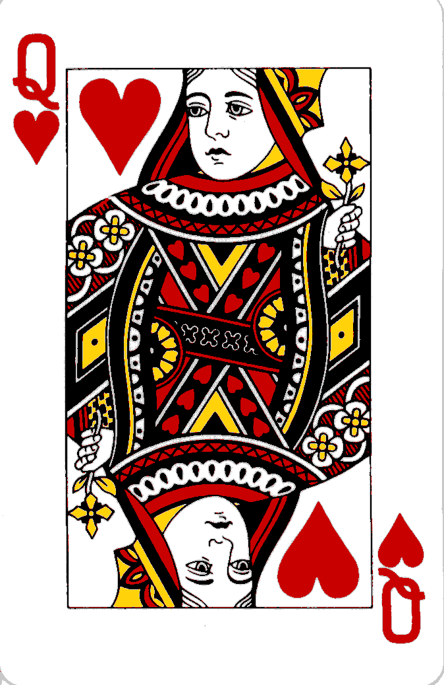

# redqueen
Project goal: C++ Program with user interface that demonstrates the red queen hypothesis

Inspiration: Card game played in the Marine Evolution course that demonstrated the red queen hypothesis.

More information: 
https://en.wikipedia.org/wiki/Red_Queen_hypothesis,
imkromhout@gmail.com

(source: http://www.madore.org/~david/misc/cards.html)
